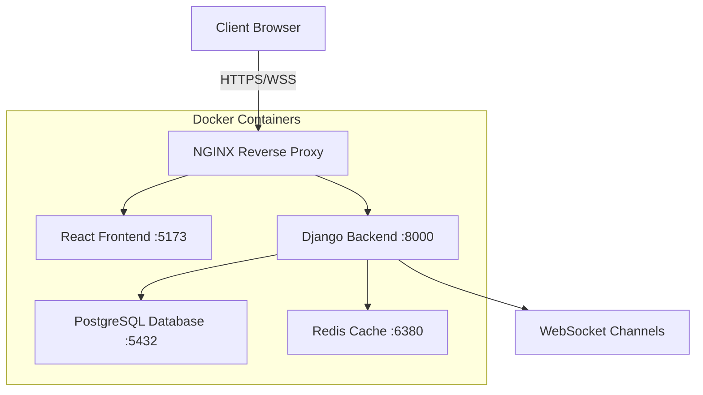

# 💬 Real-Time Chat Application

<div align="center">


*A modern, full-stack real-time chat application with secure authentication and seamless communication*

[🚀 Demo](#-getting-started) • [📖 Documentation](#-table-of-contents) • [🤝 Contributing](#-contributing) • [📄 License](#-license)

</div>

---

## 📋 Table of Contents

- [🌟 Features](#-features)
- [🏗️ Architecture](#️-architecture)
- [🛠️ Technology Stack](#️-technology-stack)
- [🚀 Getting Started](#-getting-started)
- [📱 Usage](#-usage)
- [🔧 Configuration](#-configuration)
- [📚 API Documentation](#-api-documentation)
- [🐳 Docker Commands](#-docker-commands)
- [🧪 Testing](#-testing)
- [🤝 Contributing](#-contributing)
- [📄 License](#-license)

---

## 🌟 Features

### 💬 **Chat Capabilities**
- ⚡ **Real-time messaging** with WebSocket connections
- 🔒 **Private & Group chats** with room management
- 💾 **Persistent message history** stored in PostgreSQL
- 🔔 **Instant notifications** for new messages
- 👥 **User presence indicators** and online status

### 🔐 **Authentication & Security**
- 🎟️ **JWT Authentication** with access & refresh tokens
- 🔄 **Automatic token refresh** for seamless sessions
- 👤 **User registration & profile management**
- 🛡️ **CORS protection** and secure headers
- 🔐 **HTTPS/SSL** ready with NGINX

### 🎨 **User Experience**
- 📱 **Responsive design** for all devices
- ⚡ **Smooth animations** with Framer Motion
- 🎯 **Modern UI** with Tailwind CSS
- 🌙 **Clean interface** optimized for productivity

---

## 🏗️ Architecture



---

## 🛠️ Technology Stack

<table>
<tr>
<td>

### **Frontend**
- ⚛️ **React 19** + TypeScript
- 🎨 **Tailwind CSS** for styling
- ✨ **Framer Motion** for animations
- 🔄 **React Router** for navigation
- 📡 **Axios** for API calls
- 🔌 **WebSocket** for real-time features

</td>
<td>

### **Backend**
- 🐍 **Django 4.2** + REST Framework
- 🔌 **Django Channels** for WebSockets
- 🎟️ **JWT Authentication**
- 🗄️ **PostgreSQL** database
- ⚡ **Redis** for caching & channels
- 🔒 **CORS** handling

</td>
</tr>
<tr>
<td>

### **DevOps**
- 🐳 **Docker** + Docker Compose
- 🌐 **NGINX** reverse proxy
- 🔐 **SSL/TLS** certificates
- 📊 **Logging** & monitoring
- 🔄 **Hot reload** in development

</td>
<td>

### **Tools**
- 📦 **Vite** build tool
- 🧹 **ESLint** code linting
- 📝 **TypeScript** type safety
- 🎯 **Make** build automation
- 🐙 **Git** version control

</td>
</tr>
</table>

---

## 🚀 Getting Started

### 📋 Prerequisites

Make sure you have the following installed:

```bash
# Required
🐳 Docker & Docker Compose
🐙 Git

# Optional (for development)
📦 Node.js 18+ 
🐍 Python 3.11+
```

### ⚡ Quick Start

1. **Clone the repository**
   ```bash
   git clone https://github.com/yamajid/Chat_App.git
   cd Chat_App
   ```

2. **Set up environment variables**
   ```bash
   # Copy the example environment file
   cp .env.example .env
   
   # Edit the .env file with your configurations
   nano .env
   ```

3. **Launch the application**
   ```bash
   # Build and start all services
   make up
   
   # Alternative using docker-compose directly
   docker-compose up --build
   ```

4. **Access the application**
   ```
   🌐 Frontend:     https://localhost
   🔧 Backend API:  https://localhost/api/
   🔌 WebSocket:    wss://localhost/ws/
   📊 Database:     localhost:5432
   ```

### 🎯 First Time Setup

After starting the application:

1. **Create a superuser** (optional)
   ```bash
   make shell-backend
   python manage.py createsuperuser
   ```

2. **Visit the app** at `https://localhost`
3. **Register a new account** or login
4. **Start chatting!** 🎉

---

## 📱 Usage

### 👤 **User Registration & Login**
1. Navigate to the registration page
2. Create your account with username, email, and password
3. Login with your credentials
4. Your session will be automatically maintained

### 💬 **Chatting**
1. **Join General Chat**: Start chatting immediately in the general room
2. **Create Private Chats**: Click on users to start private conversations
3. **Real-time Updates**: Messages appear instantly without page refresh
4. **Notifications**: Get notified of new messages even when in other chats

### ⚙️ **Profile Management**
1. Click on your profile to update information
2. Change username, email, or password
3. View your chat history and settings

---

## 🔧 Configuration

### 🌍 Environment Variables

Create a `.env` file in the root directory:

```env
# Database Configuration
DB_NAME=chatapp_db
DB_USER=chatapp_user
DB_PASSWORD=your_secure_password
DB_HOST=postgresql
DB_PORT=5432

# Django Settings
SECRET_KEY=your_super_secret_django_key
DEBUG=True
ALLOWED_HOSTS=localhost,127.0.0.1

# JWT Settings
JWT_SECRET_KEY=your_jwt_secret_key
JWT_ACCESS_TOKEN_LIFETIME=15
JWT_REFRESH_TOKEN_LIFETIME=7

# Redis Configuration
REDIS_URL=redis://redis:6379/0

# NGINX Configuration
NGINX_HOST=localhost
NGINX_PORT=443
```

### 🐳 Docker Configuration

The application uses Docker Compose with the following services:

- **Frontend**: React app on port 5173
- **Backend**: Django API on port 8000
- **Database**: PostgreSQL on port 5432
- **Cache**: Redis on port 6380
- **Proxy**: NGINX on port 443 (HTTPS)

---

## 📚 API Documentation

### 🔐 Authentication Endpoints

```http
POST /api/user/register/     # User registration
POST /api/user/login/        # User login
POST /api/user/logout/       # User logout
POST /api/user/token/refresh/ # Refresh JWT token
```

### 💬 Chat Endpoints

```http
GET  /api/general/           # Get general chat messages
POST /api/general/           # Send message to general chat
GET  /api/rooms/             # Get user's chat rooms
POST /api/rooms/create/      # Create new chat room
```

### 🔌 WebSocket Endpoints

```websocket
wss://localhost/ws/general/           # General chat room
wss://localhost/ws/private/{user_id}/ # Private chat with user
```

### 📝 Example API Usage

```javascript
// Login request
const response = await axios.post('/api/user/login/', {
  username: 'your_username',
  password: 'your_password'
});

// Send message via WebSocket
const socket = new WebSocket('wss://localhost/ws/general/');
socket.send(JSON.stringify({
  'message': 'Hello, World!',
  'sender': 'username'
}));
```

---

## 🐳 Docker Commands

### 🚀 **Quick Commands**

```bash
# Start all services
make up

# Stop all services
make down

# View running containers
make ps

# View logs
docker-compose logs -f [service_name]
```

### 🔧 **Development Commands**

```bash
# Access container shells
make shell-backend    # Django backend shell
make shell-frontend   # React frontend shell
make shell-nginx      # NGINX shell
make shell-redis      # Redis shell

# Database operations
make shell-backend
python manage.py migrate
python manage.py collectstatic
```

### 🧹 **Cleanup Commands**

```bash
# Remove containers and volumes
make down

# Full system cleanup
make fclean

# Remove unused Docker resources
docker system prune -a --volumes
```

---

## 🧪 Testing

### 🧪 **Backend Tests**

```bash
# Run Django tests
make shell-backend
python manage.py test

# Run with coverage
python -m pytest --cov=.
```

### ⚛️ **Frontend Tests**

```bash
# Run React tests
make shell-frontend
npm test

# Run with coverage
npm run test:coverage
```

### 🔌 **WebSocket Testing**

Test WebSocket connections using browser dev tools or tools like `wscat`:

```bash
# Install wscat
npm install -g wscat

# Test general chat
wscat -c wss://localhost/ws/general/
```

---

## 🔍 Troubleshooting

### 🐛 **Common Issues**

<details>
<summary><strong>Port Already in Use</strong></summary>

```bash
# Find process using port
lsof -i :5173  # or :8000, :5432, etc.

# Kill the process
kill -9 <PID>

# Or change ports in docker-compose.yml
```
</details>

<details>
<summary><strong>Database Connection Error</strong></summary>

```bash
# Check if PostgreSQL is running
make ps

# Reset database
make down
docker volume rm chat_app_postgres_data
make up
```
</details>

<details>
<summary><strong>SSL Certificate Issues</strong></summary>

```bash
# Regenerate certificates
make shell-nginx
./generate_ssl_cert.sh

# Or disable HTTPS in development
# Edit nginx.conf to use HTTP
```
</details>

### 📊 **Monitoring & Logs**

```bash
# View all logs
docker-compose logs -f

# View specific service logs
docker-compose logs -f backend
docker-compose logs -f frontend
docker-compose logs -f nginx

# Monitor resource usage
docker stats
```

---

## 🏗️ Development

### 🔧 **Local Development Setup**

For development with hot reload:

```bash
# Start only infrastructure services
docker-compose up postgres redis nginx

# Run frontend locally
cd frontend/vite_project
npm install
npm run dev

# Run backend locally
cd backend/core
pip install -r requirements.txt
python manage.py runserver
```

### 📁 **Project Structure**

```
Chat_App/
├── 📁 backend/
│   └── 📁 core/           # Django application
│       ├── 📁 authentication/
│       ├── 📁 chat_backend/
│       ├── 📄 settings.py
│       └── 📄 requirements.txt
├── 📁 frontend/
│   └── 📁 vite_project/   # React application
│       ├── 📁 src/
│       ├── 📄 package.json
│       └── 📄 vite.config.ts
├── 📁 deployment/
│   ├── 📁 nginx/          # NGINX configuration
│   └── 📁 redis/          # Redis configuration
├── 📄 docker-compose.yml
├── 📄 Makefile
└── 📄 README.md
```

### 🎯 **Contributing Guidelines**

1. **Fork** the repository
2. **Create** a feature branch: `git checkout -b feature/amazing-feature`
3. **Commit** your changes: `git commit -m 'Add amazing feature'`
4. **Push** to the branch: `git push origin feature/amazing-feature`
5. **Open** a Pull Request

---

## 🤝 Contributing

We welcome contributions! Please see our [Contributing Guidelines](CONTRIBUTING.md) for details.

### 🙏 **Contributors**

<a href="https://github.com/yamajid/Chat_App/graphs/contributors">
  
</a>

---

## 📈 Roadmap

- [ ] 🎥 **Video/Voice calls** integration
- [ ] 📁 **File sharing** capabilities
- [ ] 🌙 **Dark/Light theme** toggle
- [ ] 📱 **Mobile app** (React Native)
- [ ] 🔍 **Message search** functionality
- [ ] 🤖 **Bot integration** support
- [ ] 📊 **Analytics dashboard**
- [ ] 🌍 **Internationalization** (i18n)

---

## ⭐ Support

If you find this project helpful, please consider giving it a ⭐!

### 📞 **Getting Help**

- 📧 **Email**: yamajid@example.com
- 🐛 **Issues**: [GitHub Issues](https://github.com/yamajid/Chat_App/issues)
- 💬 **Discussions**: [GitHub Discussions](https://github.com/yamajid/Chat_App/discussions)

---

## 📄 License

This project is licensed under the MIT License - see the [LICENSE](LICENSE) file for details.

---

## 🎉 Acknowledgments

- Thanks to all contributors who helped build this project
- Inspired by modern chat applications like Discord and Slack
- Built with ❤️ using open-source technologies

---

<div align="center">

**[⬆ Back to Top](#-real-time-chat-application)**

Made with ❤️ by [yamajid](https://github.com/yamajid)

</div>